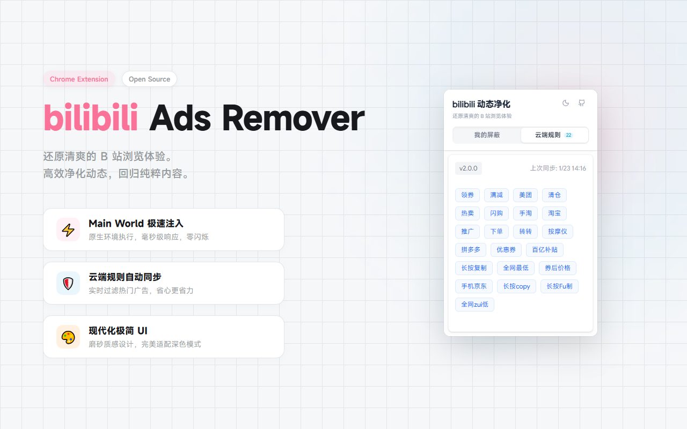

# bilibili Ads Remover

<div align="center">
  

  <h1>bilibili Ads Remover</h1>

  <p>
    <b>还原清爽的 B 站浏览体验</b>
  </p>

  <p>
    <a href="https://chromewebstore.google.com/detail/bilibili-ads-remover/lkbhpmkdbfpalgbckhnjlpjdoogboofb">
      
    </a>
    <a href="https://github.com/14Kay/chrome-bili-ads-remove/releases">
      
    </a>
    
    
  </p>
</div>



一款轻量级、高性能的 Chrome 扩展，专注于净化 Bilibili 动态页面。采用最新的 **Manifest V3** 架构与 **Main World Script** 注入技术，实现了零延迟的动态广告/推广内容拦截。

## ✨ 核心特性 (v2.0)

-   🚀 **极速拦截**: 采用 Main World 注入技术，在页面加载极早期介入，拦截成功率 100%。
-   🎨 **全新 UI**: 现代化极简设计，磨砂质感，完美适配深色模式 (Dark Mode)。
-   🛡️ **动态过滤**: 
    -   **云端规则**: 自动同步云端屏蔽词库，轻松过滤常见垃圾推广。
    -   **自定义规则**: 支持添加个性化屏蔽关键词（本地同步存储）。
-   ⚡ **零侵入**: 仅拦截 API 请求层面的广告数据，不破坏页面 DOM 结构，无白屏闪烁。

## 🛠️ 安装说明

### 🛒 Chrome 应用商店安装 (推荐)

直接访问 [Chrome Web Store](https://chromewebstore.google.com/detail/bilibili-ads-remover/lkbhpmkdbfpalgbckhnjlpjdoogboofb) 点击 "添加到 Chrome" 即可。

### 📦 离线安装 (开发者模式)

1.  下载最新 [Release](https://github.com/14Kay/chrome-bili-ads-remove/releases) 的 `zip` 包并解压。
2.  打开 Chrome 扩展管理页面 `chrome://extensions/`。
3.  开启右上角的 **"开发者模式"**。
4.  点击 **"加载已解压的扩展程序"**，选择解压后的文件夹即可。

### 源码编译安装

如果你想体验最新的开发版：

```bash
# 克隆仓库
git clone https://github.com/14Kay/chrome-bili-ads-remove.git

# 安装依赖 (推荐使用 pnpm)
pnpm install

# 构建生产版本
pnpm build

# 然后在 Chrome 中加载 dist 目录
```

## 📖 使用指南

### 屏蔽规则

插件采用 **双重过滤机制**：

1.  **云端规则 (Cloud Rules)**:
    -   内置常用屏蔽词（如：拼多多、领券、全网最低等）。
    -   每 24 小时自动更新，无需人工干预。
    -   拦截常见的电商推广、营销动态。

2.  **我的屏蔽 (My Blocklist)**:
    -   完全私有的自定义列表，通过 Chrome Sync 跨设备同步。
    -   支持手动添加任意关键词（如某人名、某话题等）。
    -   可随时添加/删除，即时生效。

### 拦截原理

不同于传统的 CSS 隐藏（AdBlock 模式），本项目采用 **API 级拦截**：

-   劫持 B 站 `web-dynamic` API 响应。
-   在数据渲染到页面**之前**清洗掉包含屏蔽词的动态卡片。
-   结果：页面根本不会渲染广告 DOM，不仅干净，而且不仅省流量还更流畅。

## 📝 更新日志

### v2.0.0 (Major Update)
-   **UI 重构**: 全新设计的 Popup 界面，更精致的交互体验。
-   **核心重构**: 迁移至 Main World Script，解决竞态问题，拦截更稳定。
-   **性能优化**: 引入 Promise 锁机制，确保规则加载无延迟。
-   **功能增强**: 用户规则与云端规则彻底分离，新增实时同步状态显示。

## 🤝 贡献

欢迎提交 Issue 或 Pull Request！

## 📄 许可证

MIT License © 2026 14Kay